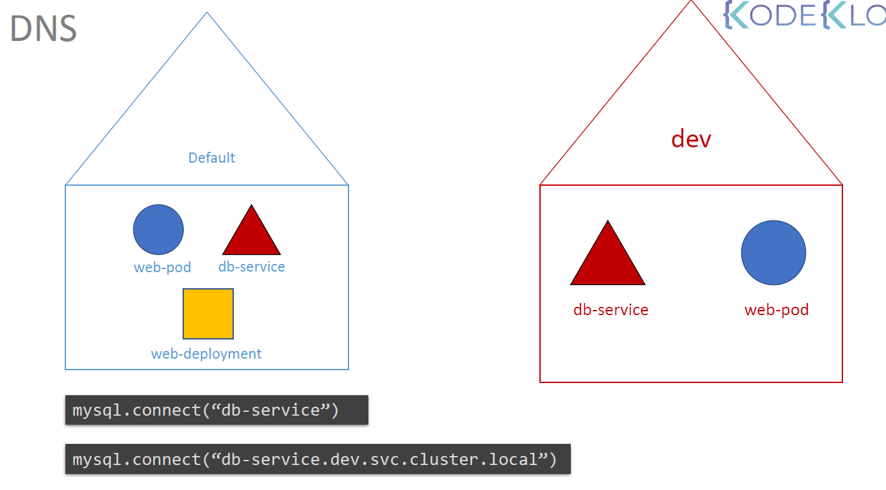

# Namespace
- Namespace is grouping strategy. We can set limits for resources in the namespace.
- Kubernetes creates 3 namespaces by default: default, kube-system, kube-public.
  - default: Default namespace for objects with no namespace.
  - kube-system: Namespace for objects created by Kubernetes system. Kubernetes creates important internal objects in this namespace.
  - kube-public: Namespace for objects that should be accessible to all users.
- We can create our own namespaces.

# DNS
- Kubernetes has a built-in DNS service.
- We can access services and pods by their names.
- For example;



- If we connect the in another namespace services, we have to use;
  - `service-name.namespace-name.svc.cluster.local`
  - svc.cluster.local is the domain name of the cluster.

# Yaml Definition
- We can define namespace in yaml file.
- For example;
```yaml
apiVersion: v1
kind: Namespace
metadata:
  name: my-namespace

---
apiVersion: v1
kind: Pod
metadata:
  name: my-pod
  namespace: my-namespace
spec:
    containers:
    - name: my-container
      image: nginx
```

# Commands
- We can create namespace with `kubectl create namespace my-namespace`.
- We can get namespaces with `kubectl get namespaces`.
- We can get pods in a namespace with `kubectl get pods -n my-namespace`.
- We can change the default namespace with `kubectl config set-context --current --namespace=my-namespace`.
- We can get default namespace with `kubectl config current-context`.
- We can get all resources in the namespace with `kubectl get all -n my-namespace`.
- We can get all resources in all namespaces with `kubectl get all --all-namespaces` or `kubectl get all -A`.
- We can get help with `kubectl get --help`.

# Resource Quota
- We can set limits for resources in the namespace.
- For example;

```yaml
apiVersion: v1
kind: ResourceQuota
metadata:
  name: my-quota
  namespace: my-namespace
spec:
    hard:
        pods: "10" # Maximum number of pods
        requests.cpu: "4" # Maximum CPU request
        requests.memory: 5Gi # Maximum memory request
        limits.cpu: "10" # Maximum CPU limit
        limits.memory: 10Gi # Maximum memory limit
```