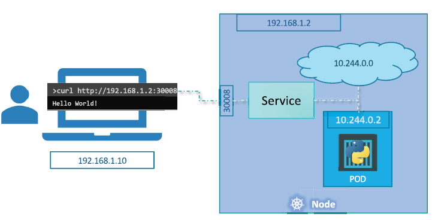
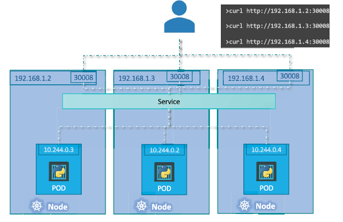
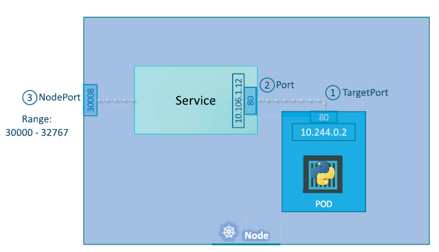

# Service
- Service is a way to expose an application running on a set of Pods as a network service.
- Service is a REST object in Kubernetes, similar to Pod.
- Service have 3 types for exposing the service for different concepts.
  - ClusterIP
    - Exposes the service on a cluster-internal IP.
  - NodePort
    - Exposes the service on each Node's IP at a static port.
  - LoadBalancer
    - Exposes the service externally using a cloud provider's load balancer.


# How is Service work?


- Every node have an external IP address for the accessibility.
- In this picture, Node external IP address is `192.168.1.2`.
- My computer is in the same network with the Kubernetes cluster. Because of that computer IP address is `192.168.1.10`.
- Pods networks are start with `10.244.0.0`. Our pod's IP address is `10.244.0.2`.
- If we don't have a service, we can't access the pods directly.
  - If we do ssh to the node, we can access the pods. Because we will be in the same network with the pods.
- But we don't want to do that. We want to access the pods from the outside of the cluster with our rules.
- We can create a service for that. Service will get our request and redirect it to the pods.
- Service can get the requests from the opened ports. We can define the ports in the service definition.
- Service can get requests from `192.168.1.2:30008` and redirect it to the pod IP address.

> Note: When our all pods in the different nodes, kubernetes guarantee to the accessibility. If the pod is not accessible. 
> Kubernetes creates the service globally. Every pod can access the service. And service can expose the pods from same port.




# NodePort Service


- NodePort is a way to expose the service on each Node's IP at a static port.
- NodePort send to request to the pods randomly. This is different from the LoadBalancer.
- NodePort can have 3 port definitions.
  - `targetPort`
    - The port on the pod that the service will redirect the request. (Where will I access the pod?)
    - If we don't give the targetPort, kubernetes will assume that the targetPort is the same with the port.
  - `port`
    - The service that the service will go to the pods from this port. (Which port will I access the service?)
  - `nodePort`
    - The port that the service will listen to the requests from the outside of the cluster.
    - If we don't give the nodePort, kubernetes will assign a random port between 30000-32767.
    - This port can be defined in the range of 30000-32767.
- We can define multiple ports in the service definition.
- Maybe we can have multiple containers in the pod. We can define the ports for each container in the service definition.
- ...

``` yaml
apiVersion: v1
kind: Service
metadata:
  name: my-nodeport-service
spec:
    type: NodePort
    selector:
      app: my-app
    ports:
    - targetPort: 80
      port: 80
      nodePort: 30008
```


# ClusterIP Service
- ClusterIP is a way to expose the service on a cluster-internal IP.
- ClusterIP is the default service type.
- We want to access with the service internally, because if any pod is down, this service will redirect the request to the other pods until the pod is up.

``` yaml
apiVersion: v1
kind: Service
metadata:
  name: my-clusterip-service
spec:
    type: ClusterIP
    selector:
      app: my-app
    ports:
    - targetPort: 80
      port: 80
```

# LoadBalancer Service
- LoadBalancer is a way to expose the service externally using a cloud provider's load balancer.

``` yaml
apiVersion: v1
kind: Service
metadata:
  name: my-loadbalancer-service
spec:
    type: LoadBalancer
    selector:
      app: my-app
    ports:
    - targetPort: 80
      port: 80
```

# Endpoints
- Endpoints are the IP addresses of the pods that attached to the service.

``` yaml
kubectl describe service nodeport-service

# ...
# Port: 6443/TCP
# Endpoints: 10.53.180.9:6443
# ...
```
