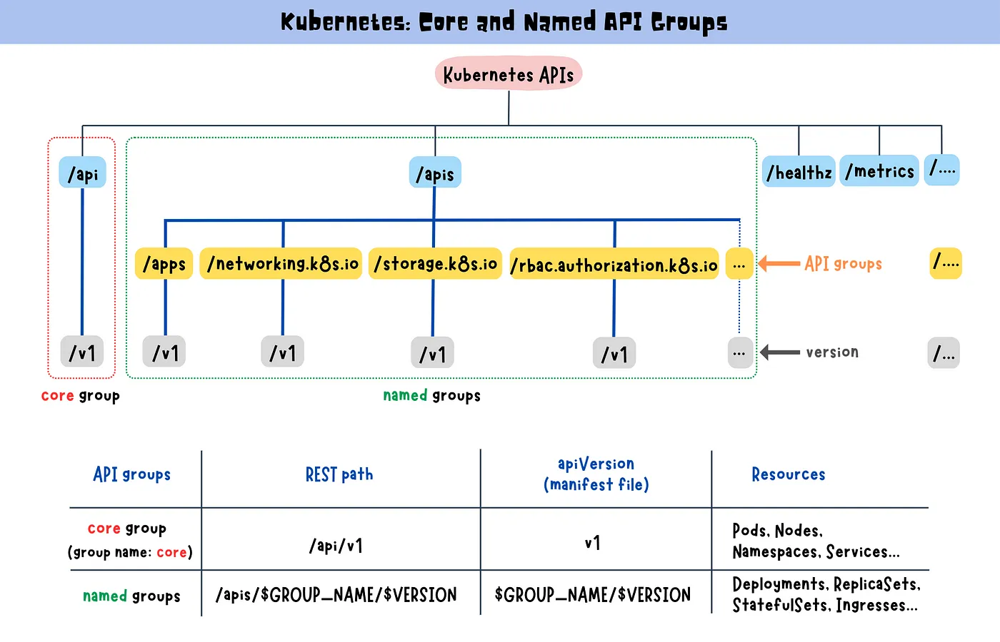

# Api Groups
In the first step, we will list all the available APIs in the cluster.

/metrics
/apis
/api
/version
/healthz
/logs

These api brackets are the root level APIs.

```bash
curl https://api.k8s.example.com/api/v1/pods

curl https://api.k8s.example.com/apis/apps/v1/deployments
```


- Api groups are the way to extend the Kubernetes API.
- We have 2 types of API groups: core and named.

- Core API groups are the default API groups that Kubernetes provides.

- /api
  - /v1
    - /pods
    - /services
    - /namespaces
    - /nodes
    - /events
    - /configmaps
    - /secrets
    - /bindings
    - ...

- Named API groups are the custom API groups that are created by users.

> (First names is `api groups` (/apps, /extensions, /networking.k8s.io, /storage.k8s.io, /rbac.authorization.k8s.io, /authentication.k8s.io, /certificates.k8s.io).

> The second names is `resources` (deployments, replicasets, statefulsets, daemonsets, roles, rolebindings, tokenreviews, certificatesigningrequests, storageclasses, networkpolicies)

> The third names is `verbs` (list, get, create, update, delete, watch)

- /apps
  - /v1
    - /deployments
      - list
      - get
      - create
      - update
      - delete
      - watch
    - /replicasets
    - /statefulsets
    - /daemonsets
    - /deployments
    - /replicasets
    - /statefulsets
    - /daemonsets
    - ...
  - /v1beta1
    - /deployments
    - /replicasets
    - /statefulsets
    - /daemonsets
    - ...
- /extensions
- /networking.k8s.io
  - /v1
    - /networkpolicies
    - ...
- /storage.k8s.io
  - /v1
    - /storageclasses
    - ...
- /rbac.authorization.k8s.io
  - /v1
    - /roles
    - /rolebindings
    - ...
- /authentication.k8s.io
  - /v1
    - /tokenreviews
    - ...
- /certificates.k8s.io
  - /v1
    - /certificatesigningrequests
    - ...



---

We can see the root apis with the following command:

```bash
curl https://api.k8s.example.com/ -k

# {
#   "paths": [
#     "/metrics",
#     "/apis",
#     "/api",
#     "/version",
#     "/healthz",
#     "/logs",
#     ...
#   ]
```

We can see the available API groups with the following command:

```bash
curl https://api.k8s.example.com/apis -k | grep "name"

# "name": "apps",
# "name": "extensions",
# "name": "networking.k8s.io",
# "name": "storage.k8s.io",
# .....................
```

We sent a request without certificate information because of that we should use a connection.
    
```bash
# We can use the kubectl proxy command to create a connection.
# This command creates a proxy server that listens on port 8001.
# It will use the kubeconfig file to authenticate with the Kubernetes API server.
kubectl proxy

# Now we can send a request to the Kubernetes API server using the proxy server.
curl http://localhost:8001/apis -k | grep "name"
```